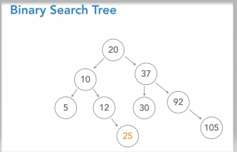

# Data-Structures-and-Algorithms-Problems
####1. Binary Search Tree:
   1. Each node has, at most, two children: left and right
   2. Each node has a numeric value associated with it
   3. Children to the left must have lesser value than their parents
   4. Children to the right must have  value than their parents
   5. No duplicate values
  
   

Tree traversing is 3 types:
   1. <b>Pre-order</b> <i>(Starts from root node then goes  left prints that node and then keeps going left as much as it can before going right)
   2. <b>In-order</b> <i>(Starting from smallest node and going to the largest node)
   3. <b>Post-order</b> <i>(Go left to right visiting the root last)

Height of trees:
   Count of the height starts from root node(0).
   And the if one tree is having left-height as 4 and right height as 5 then it's return 5 as it's height 
