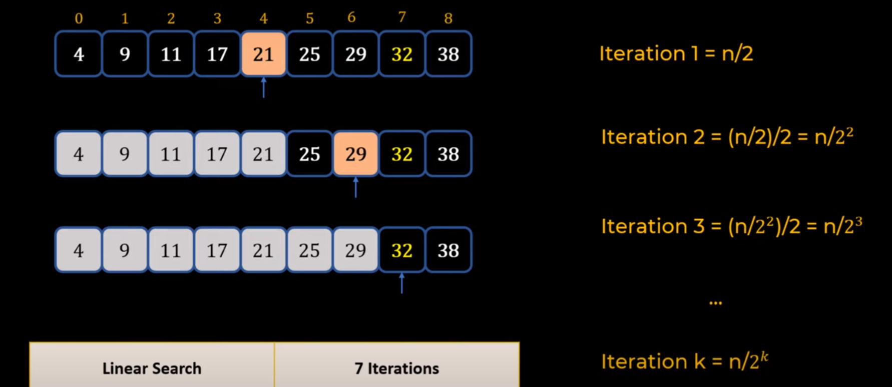
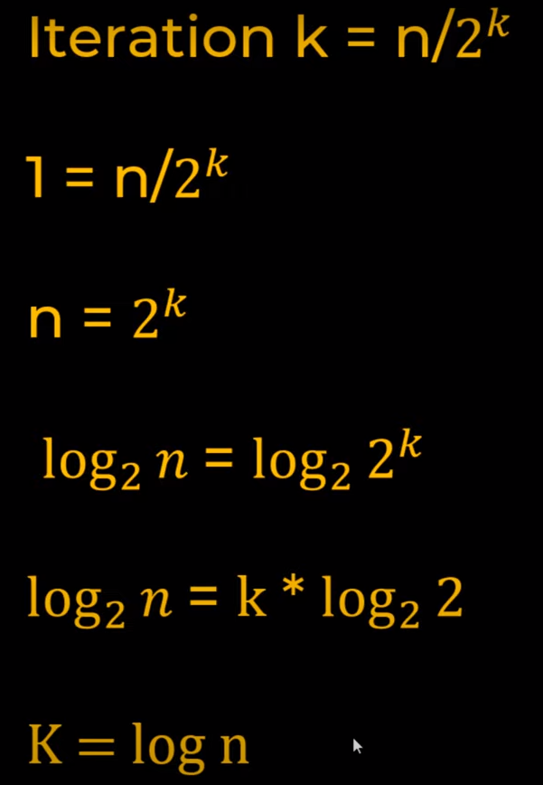

# Data-Structures-and-Algorithms-Problems
####1. Binary Search:

1. Array should be sorted
2. Start from the middle of the array
3. If searching number present in left side then discard right side
4. Again from the left middle start searching

5. Searching is O(logn)

